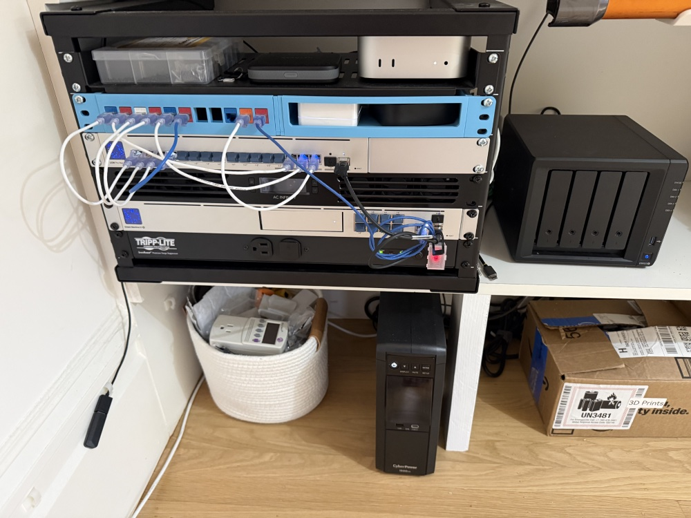

Christine's Homelab
===================
This is a docker compose infrastructure that runs a variety of services on a Mac Mini in my home.



At its heart is a home automation platform [Home Assistant](https://www.home-assistant.io/), which I use for remote
control of my home (e.g. turning on/off lights), and automating things around the house (e.g. opening blinds in
the morning).

I want to make this *production ready™* with some nice features like:

* [SSL Certificates](docker/certbot) via certbot
* [Monitoring](docker/monitoring) (grafana, influxdb, loki, alloy, telegraf)
* [UPS Monitoring](docker/nut)
* [Nginx Reverse Proxy](docker/nginx)

This attempts to use best practices when possible:

* Use docker secrets to avoid exposing secret data (secrets managed via [git-secret](https://github.com/sobolevn/git-secret))

## git-secret setup
> *See also: [git-secret docs](https://github.com/sobolevn/git-secret)*

First time setup:

```sh
brew install git-secret
# Decrypt existing secrets
git secret reveal
```

Add a new secret

```sh
echo "content" > secrets/foo.txt
git secret add secrets/foo.txt
git secret hide
```

Modified a secret?

```sh
git secret hide
```
